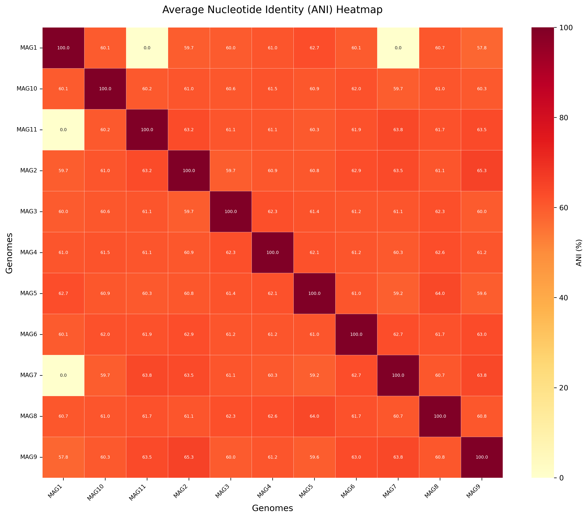

# PyOrthoANI 基因组ANI计算工具


一个基于pyorthoani的交互式基因组平均核酸一致性(ANI)计算与可视化工具，支持批量处理和多格式输出。

## 功能特性

- 🖥️ **交互式界面**：友好的命令行交互体验
- 🧬 **多格式支持**：支持.fa, .fasta, .fna, .ffn格式
- 📊 **智能可视化**：自动生成ANI热图和统计报告
- ⚡ **高效计算**：利用pyorthoani进行快速比对
- 📂 **灵活输出**：支持自定义输出目录
- 🛡️ **健壮性**：完善的错误处理和日志系统

## 安装指南

### 前置要求

- Python 3.12+
- blast
- pyorthoani (建议安装前创建新的环境，先安装blast)
- 以下Python包：
  - numpy
  - pandas
  - matplotlib
  - seaborn
  - tqdm

### 安装步骤

1. 克隆仓库：

   ```bash
   git clone https://github.com/whb2468/pyorthoani-tool.git
   cd pyorthoani-tool
   ```

2. 创建conda环境（推荐）：
  
   ```bash
   conda create -n pyorthoani
   conda activate pyorthoani
   ```

3. 安装依赖

   ```bash
   conda install balst
   pip install pyorthoani
   conda install numpy pandas matplotlib seaborn tqdm
   ```

## 使用说明

1. 基本用法

    ```bash
    python3 pyorthoani.py
    ```

    程序将引导您完成以下步骤：
  
    输入基因组文件目录
    选择输出目录
    预览检测到的基因组文件
    确认开始计算

2. 命令行选项
  
    参数  描述    默认值
    -i, --input   指定输入目录    当前目录
    -o, --output  指定输出目录    当前目录
    -q, --quiet   静默模式（减少输出）    False
  
    示例:

    ```bash
    python3 pyorthoani.py -i ./genomes -o ./results
    ```

3. 输出文件说明
  
    文件名   描述
    ani_pairs.csv   所有基因组对的ANI结果
    ani_matrix.csv  ANI矩阵(CSV格式)
    ani_stats.txt   统计摘要(最小值/最大值/平均值)
    ani_heatmap.png ANI热图可视化
    ani_calculation.log   详细运行日志

## 结果解读

1. ANI值说明
  
    95%以上：通常认为属于同一物种
    90-95%：同一属的不同物种
    90%以下：不同属的微生物

2. ANI热图示例
    

3. 热图颜色说明：

    红色：高相似度（90-100%）
    黄色：中等相似度(70-90%)
    白色：低相似度(<70%)或计算失败

## 常见问题

1. 计算过程中出现错误怎么办？
    检查ani_calculation.log文件获取详细错误信息。常见问题：
     pyorthoani未正确安装
     输入文件不是有效的FASTA格式
     文件权限问题

2. 如何处理大量基因组文件？
    对于超过50个基因组：
    使用--quiet模式减少输出
    考虑分批处理
    确保有足够的内存(建议≥16GB)

3. 为什么有些比对结果是0？
    这表示两个基因组间几乎不存在保守区域，可能是：
    进化距离很远的基因组
    高度重排的基因组
    输入文件质量问题

## 性能优化建议

1. 预处理基因组文件：
    确保文件没有多余的空格或特殊字符
    统一使用.fa作为扩展名

2. 并行计算：
    修改脚本添加多进程支持:

    ```python
    from multiprocessing import Pool
    ```

3. 使用SSD存储：
    可以显著提高I/O密集型操作的性能

## 开发者指南

项目结构
 pyorthoani-tool/
 ├── pyorthoani_pro.py      # 主程序
 ├── requirements.txt       # 依赖列表
 ├── LICENSE
 └── README.md
扩展功能
 添加新的文件格式支持：
 修改supported_ext列表
 添加相应的验证函数
 集成其他ANI工具：
 可以添加FastANI作为备选引擎
 增加网络功能：
 添加远程文件下载支持
 结果自动上传功能

## 贡献指南

 欢迎提交Issue和Pull Request。请遵循以下规范：
 使用Google风格代码注释
 保持代码风格一致
 新功能需附带单元测试

## 许可证

 本项目采用MIT许可证 - 详情请见LICENSE文件。
